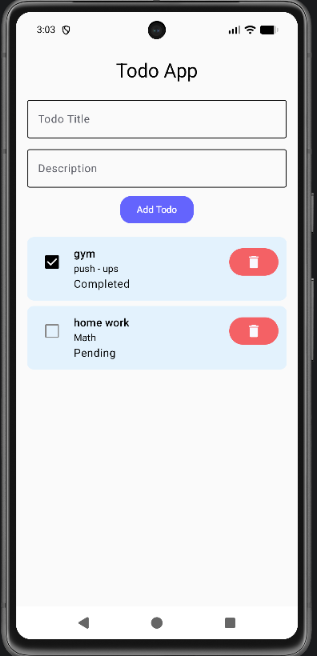

# 📝 Todo App

A simple and clean **Todo App** built with **Kotlin and Jetpack Compose**.
The app allows users to create, complete, and delete tasks while storing todo data locally using **Room Database**.

## 📱 Preview



## ✨ Features

* ➕ Add a new Todo
* 📋 View all Todos
* ✅ Mark Todo as Completed
* ⏳ Show Pending and Completed status
* 🗑️ Delete Todo
* ⚠️ Delete confirmation dialog
* 💾 Store Todos locally using Room Database
* 🔄 Reactive UI updates
* 🎨 Clean and simple Jetpack Compose UI
* 🌙 Supports system theme

## 🛠️ Tech Stack

* **Kotlin**
* **Jetpack Compose**
* **Material 3**
* **Room Database**
* **ViewModel**
* **Kotlin Coroutines**
* **Flow**
* **MVVM Architecture**
* **Android Jetpack**

## 🏗️ Architecture

The project follows the **MVVM (Model-View-ViewModel)** architecture.

```text
UI (Jetpack Compose)
        ↓
    ViewModel
        ↓
    Repository
        ↓
   Room Database
```

## 📂 Project Structure

```text
com.example.todoapp
│
├── data
│   ├── TodoDao.kt
│   ├── TodoDatabase.kt
│   └── TodoRepository.kt
│
├── model
│   └── Todo.kt
│
├── viewmodel
│   └── TodoViewModel.kt
│
└── ui
    ├── TodoScreen.kt
    └── TodoItem.kt
```

## 🚀 How It Works

1. Enter a **Todo Title**.
2. Enter a **Description**.
3. Tap **Add Todo**.
4. The Todo is saved in the local Room database.
5. Use the checkbox to mark a Todo as completed.
6. Tap the delete button to remove a Todo.
7. A confirmation dialog appears before deletion.

## 🎯 Learning Outcomes

Through this project, I practiced:

* Jetpack Compose UI development
* State management in Compose
* MVVM architecture
* Room Database integration
* CRUD operations
* ViewModel and Repository pattern
* Kotlin Coroutines and Flow
* Handling user interactions
* Building a responsive Android UI

## 🔮 Future Improvements

* ✏️ Edit Todo
* 🔍 Search Todos
* 🏷️ Add Todo categories
* 📅 Add due dates
* 🔔 Todo reminders
* 📊 Todo statistics
* 🔐 User authentication

## 👨‍💻 Author

**Manoj Kumar**

Android Developer | Kotlin | Jetpack Compose

---

⭐ If you find this project useful, consider giving it a star!
